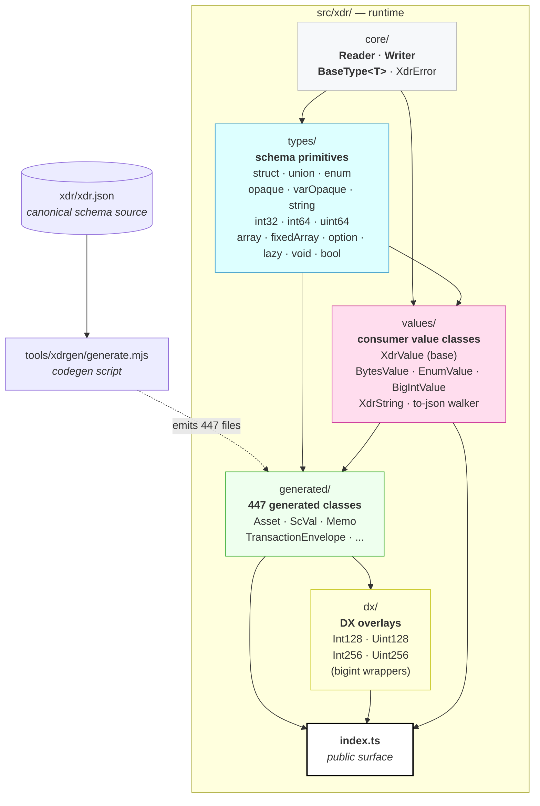
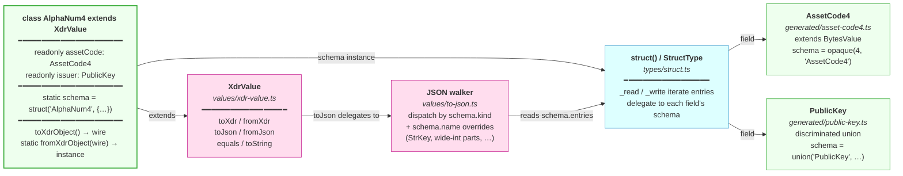
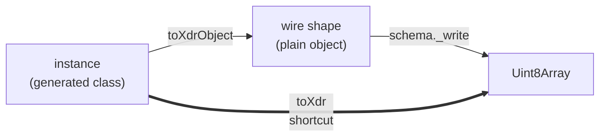
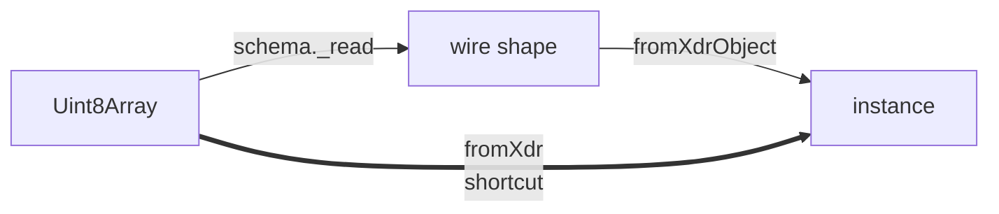
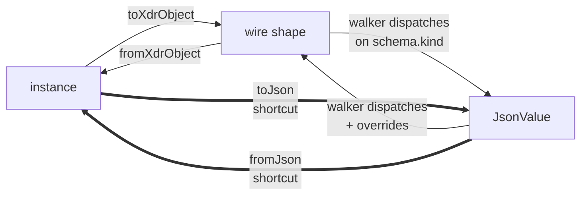

# XDR Architecture

This document describes the internal architecture of the in-tree XDR layer
under `src/xdr/`. It's intended for SDK contributors — people fixing bugs,
adding types, or extending the runtime. For consumer-facing migration
guidance, see [`XDR_MIGRATION.md`](./XDR_MIGRATION.md).

The XDR layer replaces what used to be a thin wrapper around
`@stellar/js-xdr`. It's a four-layer design — `core` → `types` → `values` →
`generated`, with `dx` overlays and a public `index.ts` on top — driven by
codegen against a canonical schema file (`xdr/xdr.json`).

---

## Layered architecture



The dependency edges encode the design constraints:

- **`core/`** is the bottom — no dependencies on anything else in `xdr/`.
  Just the buffer reader/writer, the abstract `BaseType<T>` schema
  interface, and the error class. Could be lifted into a standalone XDR
  runtime as-is.
- **`types/`** depends only on `core/`. Pure schema primitives, charset-
  agnostic, with no knowledge of consumer-facing value classes. Also
  liftable into a standalone runtime — see the "Why this layering" section
  below.
- **`values/`** depends on `types/` *and* `core/`. Adds consumer ergonomics:
  the `XdrValue` base class with `toXdr`/`fromXdr`/`toJson`/`fromJson`, the
  shared subclass bases (`BytesValue`, `EnumValue`, `BigIntValue`,
  `XdrString`), and the SEP-0051 JSON walker.
- **`generated/`** is codegen output. Each file references its schema
  primitives from `types/` and extends the right value-class base from
  `values/`. 447 files, one per named XDR type.
- **`dx/`** is hand-written ergonomic overlays on top of `generated/` —
  e.g. `Int128` exposes a single `bigint` instead of the generated
  `Int128Parts` struct's `{hi, lo}` split.
- **`index.ts`** is the only public entry. Re-exports the generated barrel,
  the value-class bases, the DX overlays, the primitive shims, and the
  schema-builder primitives.

### Why this layering

The `types/` ↔ `values/` split is the central design decision. **`types/`
is a generic XDR schema runtime that knows nothing about Stellar-specific
value types, JSON, or class semantics.** It would compile and work in a
Bitcoin SDK, a NFS implementation, or any other RFC 4506 consumer.

`values/` is where Stellar's consumer ergonomics live: the `XdrValue` base
class consumers extend, the SEP-0051 JSON walker, the StrKey-aware
overrides, the `BytesValue` / `XdrString` wrappers that make byte-string-
shaped fields ergonomic. If we ever spin the XDR runtime out into a
separate package, `types/` + `core/` go together; `values/` stays here
because it's where SDK-specific behavior lives.

A practical consequence: when adding a new schema primitive, ask whether
the new primitive is generic XDR (struct, union, primitive int variant,
container) or Stellar-flavored ergonomics (StrKey override, JSON encoding
rule). The former goes in `types/`; the latter in `values/`. The codegen
is set up to dispatch on the schema's `kind` (a `types/`-level concept),
not on its `name` (which can be Stellar-specific).

---

## Anatomy of a single generated class

What you actually see when you read a generated file, using `AlphaNum4` as
the example:



Every generated class has two things:

1. **A `static readonly schema`** — built from `types/` primitives. This is
   the source of truth for wire layout. `_read` and `_write` on the
   schema do the actual byte I/O; everything else delegates to it.
2. **An instance shape that matches the schema** — fields named after XDR
   struct/union/enum members, all `readonly`, with a `toXdrObject()` that
   returns the wire shape and a `static fromXdrObject(wire)` going the
   other way.

Inherited methods (`toXdr`, `fromXdr`, `toJson`, `fromJson`, `equals`,
`toString`) all work automatically: the wire round-trip uses the schema,
and the JSON round-trip uses the walker — both of which can inspect the
schema generically because the schema graph is fully introspectable.

---

## Data flow

### Encoding (instance → bytes)



`toXdrObject()` translates the typed instance into the "wire shape" (a
plain JS object whose fields match the XDR struct/union layout). The
schema's `_write` then serializes that object into a `Uint8Array` via the
`Writer`. The `toXdr()` shortcut composes both.

### Decoding (bytes → instance)



The schema's `_read` parses bytes off a `Reader` into the wire shape;
`fromXdrObject(wire)` rebuilds the typed instance.

### JSON round-trip



JSON serialization goes through the wire shape, not the instance — that's
how the walker stays schema-driven and class-agnostic. The walker
dispatches on `schema.kind` (struct / union / enum / opaque / …) and
checks an override map keyed on `schema.name` for type-specific
serializers (StrKey forms, wide-int decimal-string collapse, asset-code
trim rules).

### Where the wire layout is decided

The wire layout is determined entirely by the `static schema` field on the
generated class. The schema is built from primitives in `types/` — each of
which knows exactly how to read and write its wire bytes per RFC 4506. The
codegen mechanically translates XDR source into the appropriate primitive
calls:

| XDR source                       | Schema expression                         |
|----------------------------------|-------------------------------------------|
| `int`                            | `int32()`                                 |
| `unsigned int`                   | `uint32()`                                |
| `hyper`                          | `int64()`                                 |
| `unsigned hyper`                 | `uint64()`                                |
| `bool`                           | `bool()`                                  |
| `opaque foo[N]`                  | `opaque(N, "Foo")`                        |
| `opaque foo<N>`                  | `varOpaque(N, "Foo")`                     |
| `string foo<N>`                  | `xdrString(N)`                            |
| `T foo<N>` (variable array)      | `array(T.schema, N)`                      |
| `T foo[N]` (fixed array)         | `fixedArray(T.schema, N)`                 |
| `T* foo` / `T foo?`              | `option(T.schema)`                        |
| `enum E { A=0, B=1 }`            | `enumType("E", { A: 0, B: 1 })`           |
| `struct S { T1 a; T2 b; }`       | `struct("S", { a: T1.schema, b: T2.schema })` |
| `union U switch (D d) { … }`     | `union("U", { switchOn: D.schema, cases: […] })` |

---

## Where to extend

When you need to change behavior, the rule of thumb is to push the change
as far down the stack as possible so the most types benefit:

| You want to…                                              | Edit here                                                       |
|-----------------------------------------------------------|-----------------------------------------------------------------|
| Add a new XDR type to the schema                          | `xdr/xdr.json` (then `pnpm run xdrgen`)                          |
| Change codegen output (TS type expr, generated factory shape, …) | `tools/xdrgen/generate.mjs`                              |
| Change wire serialization of an existing primitive kind   | `src/xdr/types/<kind>.ts`                                       |
| Add a new schema primitive (e.g. a new int variant)       | new file in `src/xdr/types/`, then wire into codegen `schemaExpr` |
| Change JSON encoding of an existing kind                  | the `walkToJson` / `walkFromJson` switch in `src/xdr/values/to-json.ts` |
| Add a Stellar-specific JSON override (e.g. new strkey)    | the `OVERRIDES` map in `src/xdr/values/to-json.ts`              |
| Add a consumer-side ergonomic helper for a class          | hand-written file in `src/xdr/dx/`                              |
| Hand-edit one specific generated class                    | **don't.** Edit codegen output is overwritten on regen — change `tools/xdrgen/generate.mjs` instead |

A few cross-cutting changes worth knowing how to do:

### Adding a new schema primitive

1. Create `src/xdr/types/<kind>.ts` with a class extending `BaseType<T>`:
   - Implement `_read(reader, path): T` and `_write(value, writer, path): void`.
   - Set `readonly kind = "<kind>"` (the discriminant the walker uses).
   - Export both the class (for type lookups) and a builder function
     `<kind>(...): XdrType<T>`.
2. Wire it into codegen — add a `case "<kind>":` to `schemaExpr` and
   `tsTypeExpr` (and `wireTypeExpr` if the wire shape differs from the
   TS-side shape).
3. If the walker should support this kind, add a `case "<kind>":` to both
   `walkToJson` and `walkFromJson` in `src/xdr/values/to-json.ts`.

### Adding a Stellar-specific JSON override

The walker's override map (`OVERRIDES` in `values/to-json.ts`) keys on
`schema.name`. To add a new override (e.g. a new StrKey form):

```ts
OVERRIDES.set("YourTypeName", {
  toJson(wire) { /* produce JSON */ },
  fromJson(json) { /* return wire shape */ },
});
```

For the override to fire on direct calls (`value.toJson()` on a top-level
instance), the schema needs a name — passed through to the primitive
builder (e.g., `opaque(N, "YourTypeName")`). The codegen does this for
named typedefs automatically; if you're hand-rolling a schema you need to
pass the name yourself.

### Adding a DX overlay

Hand-written files in `src/xdr/dx/` that wrap a generated class with a
more ergonomic shape (e.g. `Int128` exposing a single `bigint`). The
overlay typically:

1. Extends a value-class base (`BigIntValue`, `BytesValue`, …) or
   `XdrValue` directly.
2. Reuses the underlying generated class's `static schema` so wire format
   stays identical.
3. Provides convenient constructor and accessor patterns.
4. Adds the overlay to the public exports in `src/xdr/index.ts`.

---

## Testing strategy

The XDR layer has a layered test suite mirroring the layered architecture:

| Layer                          | File                                                | Purpose                                                                                          |
|--------------------------------|-----------------------------------------------------|--------------------------------------------------------------------------------------------------|
| 1. Hand-written smoke          | `test/unit/base/xdr/legacy_round_trip.test.ts`      | ~15 representative shapes; byte-equality against the legacy `@stellar/js-xdr` runtime            |
| 2. Real-traffic corpus         | `test/unit/base/xdr/corpus_round_trip.test.ts`      | Wire bytes captured from horizon mainnet; both SDKs decode/re-encode losslessly                  |
| 3. Schema-driven exhaustive    | `test/unit/base/xdr/schema_exhaustive.test.ts`      | Auto-generated default-value sample for every named class (~2000 tests, no manual additions)     |
| 4. JSON walker tests           | `test/unit/base/xdr/to_json.test.ts`                | SEP-0051 conformance per encoding rule + field-level JSON round-trips                            |
| Smoke / generated              | `test/unit/base/xdr/generated.test.ts`              | Sanity tests on codegen output (cyclic unions, lazy refs, inlined typedefs, …)                   |
| Slice                          | `test/unit/base/xdr/slice.test.ts`                  | Hand-curated round-trips for the most-used types (Asset, PublicKey, AlphaNum4, Memo, Int128, …) |

The legacy `@stellar/js-xdr`-backed generated files are checked in at
`test/fixtures/legacy-xdr/` as the wire-format oracle. Long-term once the
new SDK has stayed agreement-green for a release or two, the legacy
fixtures can be dropped and the corpus fixtures become frozen ground
truth.

To refresh the mainnet corpus:

```
pnpm tsx scripts/refresh-horizon-corpus.ts
```

---

## Key invariants

A few properties the runtime depends on. Breaking any of these will cause
broad regressions across the suite, so they're worth being deliberate
about:

- **`types/` has no `import` from `values/`.** This is enforceable by
  inspection; CI doesn't pin it yet but should.
- **Every generated class has a `static schema` and a
  `static fromXdrObject(wire)`.** `XdrValue.fromXdr` and the walker both
  depend on these being present.
- **`schema.kind` matches one of the kinds enumerated in
  `values/to-json.ts`.** Adding a new primitive without updating the
  walker will produce runtime errors on any consumer call to `toJson()`.
- **Schemas reachable from each other must form a DAG** *or* go through
  `lazy()`. Direct cyclic refs (e.g. `ScVal` containing `ScVal[]` directly
  rather than via `lazy()`) trigger a temporal-dead-zone error at module
  load. Codegen detects cycles and inserts `lazy()` automatically; a hand-
  rolled schema needs to think about this.
- **The wire layer is byte-honest for `Uint8Array` and `XdrString`
  passthrough.** Tests assume `decode(encode(x))` produces byte-identical
  output. Adding silent transformations at the wire layer (lossy
  re-encoding, charset conversion, etc.) will break the corpus tests
  immediately.
