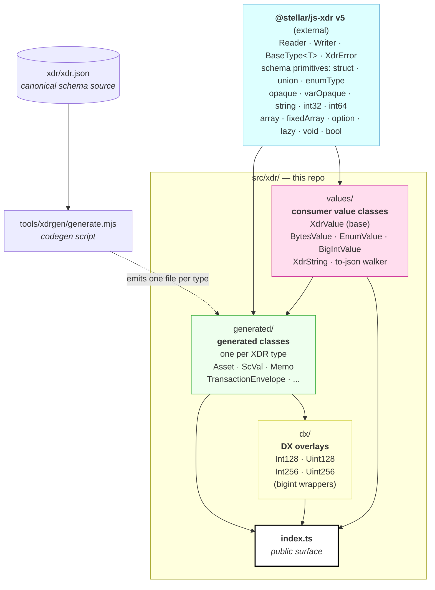
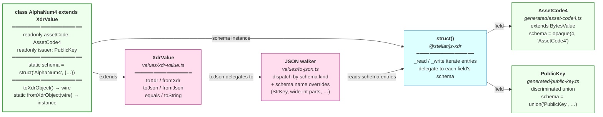
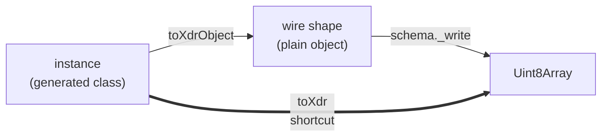
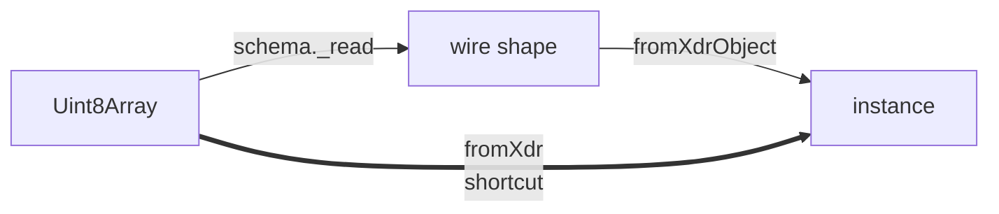
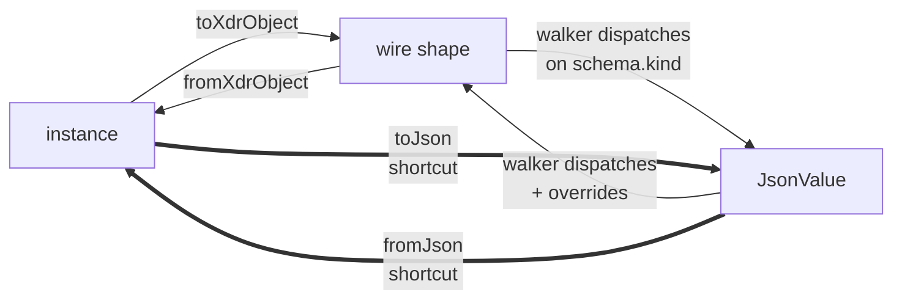

This document describes the internal architecture of the SDK's XDR layer under
`src/xdr/`. It's intended for SDK contributors — people fixing bugs, adding
types, or extending the layer. For consumer-facing migration guidance, see
[`XDR_MIGRATION.md`](./XDR_MIGRATION.md).

The layer sits on top of `@stellar/js-xdr` v5, which provides the generic RFC
4506 runtime: the `Reader`/`Writer` byte I/O, the abstract `BaseType<T>` schema
interface, and the schema primitives (`struct`, `union`, `enumType`, `opaque`,
`varOpaque`, `string`, `int32`, `int64`, `array`, `option`, `lazy`, …).
Everything Stellar-specific lives in this repo: the consumer value classes, the
SEP-0051 JSON walker, the generated class per XDR type, and the DX overlays —
driven by codegen against a canonical schema file (`xdr/xdr.json`).

---

## Layered architecture



The dependency edges encode the design constraints:

- **`@stellar/js-xdr`** is the bottom — a generic XDR schema runtime that knows
  nothing about Stellar-specific value types, JSON, or class semantics. It would
  work in a Bitcoin SDK, an NFS implementation, or any other RFC 4506 consumer.
- **`values/`** adds consumer ergonomics on top of the runtime: the `XdrValue`
  base class with `toXdr`/`fromXdr`/`toJson`/`fromJson`, the shared subclass
  bases (`BytesValue`, `EnumValue`, `BigIntValue`, `XdrString`), and the
  SEP-0051 JSON walker with its StrKey-aware overrides.
- **`generated/`** is codegen output. Each file builds its `static schema` from
  js-xdr primitives and extends the right value-class base from `values/`. One
  file per named XDR type, so the count grows as new types are added to the
  schema.
- **`dx/`** is hand-written ergonomic overlays on top of `generated/` — e.g.
  `Int128` exposes a single `bigint` instead of the generated `Int128Parts`
  struct's `{hi, lo}` split.
- **`index.ts`** is the only public entry. Re-exports the generated barrel, the
  value-class bases, the DX overlays, the primitive shims, the union narrowing
  helpers (`util.ts`), and a curated slice of the js-xdr surface (`XdrError`,
  `BaseType`, and the schema-facing types). The js-xdr `Reader`/`Writer` and
  schema-builder factories are deliberately **not** re-exported — they're
  internal runtime/authoring APIs.

### Where the generic/Stellar line is drawn

The package boundary is the central design decision: **generic XDR mechanics
belong in `@stellar/js-xdr`; Stellar-flavored ergonomics belong here.** When
adding behavior, ask which side of the line it's on. A new schema primitive (a
new int variant, a new container) is generic XDR and goes in js-xdr. A StrKey
override, a JSON encoding rule, or a friendlier constructor shape is Stellar
ergonomics and goes in `values/` or `dx/`. The codegen and the JSON walker are
set up to dispatch on the schema's `kind` (a js-xdr-level concept), with a
`name`-keyed override map for the Stellar-specific cases.

---

## Anatomy of a single generated class

What you actually see when you read a generated file, using `AlphaNum4` as the
example:



Every generated class has two things:

1. **A `static readonly schema`** — built from js-xdr primitives. This is the
   source of truth for wire layout. `_read` and `_write` on the schema do the
   actual byte I/O; everything else delegates to it.
2. **An instance shape that matches the schema** — fields named after XDR
   struct/union/enum members, all `readonly`, with a `toXdrObject()` that
   returns the wire shape and a `static fromXdrObject(wire)` going the other
   way.

Inherited methods (`toXdr`, `fromXdr`, `toJson`, `fromJson`, `equals`,
`toString`) all work automatically: the wire round-trip uses the schema, and the
JSON round-trip uses the walker — both of which can inspect the schema
generically because the schema graph is fully introspectable.

---

## Data flow

### Encoding (instance → bytes)



`toXdrObject()` translates the typed instance into the "wire shape" (a plain JS
object whose fields match the XDR struct/union layout). The schema's `_write`
then serializes that object into a `Uint8Array` via the js-xdr `Writer`. The
`toXdr()` shortcut composes both.

### Decoding (bytes → instance)



The schema's `_read` parses bytes off a js-xdr `Reader` into the wire shape;
`fromXdrObject(wire)` rebuilds the typed instance.

### JSON round-trip



JSON serialization goes through the wire shape, not the instance — that's how
the walker stays schema-driven and class-agnostic. The walker dispatches on
`schema.kind` (struct / union / enum / opaque / …) and checks an override map
keyed on `schema.name` for type-specific serializers (StrKey forms, wide-int
decimal-string collapse, asset-code trim rules).

### Where the wire layout is decided

The wire layout is determined entirely by the `static schema` field on the
generated class. The schema is built from js-xdr primitives — each of which
knows exactly how to read and write its wire bytes per RFC 4506. The codegen
mechanically translates XDR source into the appropriate primitive calls:

| XDR source                   | Schema expression                                |
| ---------------------------- | ------------------------------------------------ |
| `int`                        | `int32()`                                        |
| `unsigned int`               | `uint32()`                                       |
| `hyper`                      | `int64()`                                        |
| `unsigned hyper`             | `uint64()`                                       |
| `bool`                       | `bool()`                                         |
| `opaque foo[N]`              | `opaque(N, "Foo")`                               |
| `opaque foo<N>`              | `varOpaque(N, "Foo")`                            |
| `string foo<N>`              | `xdrString(N)`                                   |
| `T foo<N>` (variable array)  | `array(T.schema, N)`                             |
| `T foo[N]` (fixed array)     | `fixedArray(T.schema, N)`                        |
| `T* foo` / `T foo?`          | `option(T.schema)`                               |
| `enum E { A=0, B=1 }`        | `enumType("E", { A: 0, B: 1 })`                  |
| `struct S { T1 a; T2 b; }`   | `struct("S", { a: T1.schema, b: T2.schema })`    |
| `union U switch (D d) { … }` | `union("U", { switchOn: D.schema, cases: […] })` |

---

## Where to extend

When you need to change behavior, the rule of thumb is to push the change as far
down the stack as possible so the most types benefit — keeping in mind that the
bottom of the stack is a separate package:

| You want to…                                                     | Edit here                                                                                      |
| ---------------------------------------------------------------- | ---------------------------------------------------------------------------------------------- |
| Add a new XDR type to the schema                                 | `xdr/xdr.json` (then `pnpm run xdrgen`)                                                        |
| Change codegen output (TS type expr, generated factory shape, …) | `tools/xdrgen/generate.mjs`                                                                    |
| Change wire serialization of a primitive kind                    | `@stellar/js-xdr` (separate repo) — not here                                                   |
| Add a new schema primitive (e.g. a new int variant)              | `@stellar/js-xdr`, then wire into codegen `schemaExpr` and the JSON walker here                |
| Change JSON encoding of an existing kind                         | the `walkToJson` / `walkFromJson` switch in `src/xdr/values/to-json.ts`                        |
| Add a Stellar-specific JSON override (e.g. new strkey)           | the `OVERRIDES` map in `src/xdr/values/to-json.ts`                                             |
| Add a consumer-side ergonomic helper for a class                 | hand-written file in `src/xdr/dx/`                                                             |
| Hand-edit one specific generated class                           | **don't.** Codegen output is overwritten on regen — change `tools/xdrgen/generate.mjs` instead |

A few cross-cutting changes worth knowing how to do:

### Supporting a new schema primitive

The primitive itself (the `BaseType<T>` subclass with `_read`/`_write` and a
`kind` discriminant) lives in `@stellar/js-xdr`. Once it exists there, wiring it
into this layer takes two steps:

1. Add a `case "<kind>":` to `schemaExpr` and `tsTypeExpr` in
   `tools/xdrgen/generate.mjs` (and `wireTypeExpr` if the wire shape differs
   from the TS-side shape).
2. Add a `case "<kind>":` to both `walkToJson` and `walkFromJson` in
   `src/xdr/values/to-json.ts` — the walker throws on kinds it doesn't know.

### Adding a Stellar-specific JSON override

The walker's override map (`OVERRIDES` in `values/to-json.ts`) keys on
`schema.name`. To add a new override (e.g. a new StrKey form):

```ts
OVERRIDES.set("YourTypeName", {
  toJson(wire) {
    /* produce JSON */
  },
  fromJson(json) {
    /* return wire shape */
  },
});
```

For the override to fire on direct calls (`value.toJson()` on a top-level
instance), the schema needs a name — passed through to the primitive builder
(e.g., `opaque(N, "YourTypeName")`). The codegen does this for named typedefs
automatically; if you're hand-rolling a schema you need to pass the name
yourself.

### Adding a DX overlay

Hand-written files in `src/xdr/dx/` that wrap a generated class with a more
ergonomic shape (e.g. `Int128` exposing a single `bigint`). The overlay
typically:

1. Extends a value-class base (`BigIntValue`, `BytesValue`, …) or `XdrValue`
   directly.
2. Reuses the underlying generated class's `static schema` so wire format stays
   identical.
3. Provides convenient constructor and accessor patterns.
4. Adds the overlay to the public exports in `src/xdr/index.ts`.

---

## Testing strategy

The XDR layer's test suite lives under `test/unit/xdr/`:

| Layer                    | File                                                              | Purpose                                                                              |
| ------------------------ | ----------------------------------------------------------------- | ------------------------------------------------------------------------------------ |
| Hand-written smoke       | `legacy_round_trip.test.ts`                                       | Representative shapes; byte-equality against the legacy `@stellar/js-xdr` v4 runtime |
| Real-traffic corpus      | `corpus_round_trip.test.ts`                                       | Wire bytes captured from Horizon mainnet; decode/re-encode must be lossless          |
| Schema-driven exhaustive | `schema_exhaustive.test.ts`                                       | Auto-generated default-value sample for every named class (no manual additions)      |
| JSON walker              | `to_json.test.ts`                                                 | SEP-0051 conformance per encoding rule + field-level JSON round-trips                |
| Value-class units        | `enum_value.test.ts`, `bigint_parts.test.ts`, `large_int.test.ts` | The hand-written `values/` and `dx/` bases in isolation                              |

The legacy v4-backed generated files are checked in at
`test/fixtures/legacy-xdr/` as the wire-format oracle. Long-term, once the new
layer has stayed agreement-green for a release or two, the legacy fixtures can
be dropped and the corpus fixtures become frozen ground truth.

To refresh the mainnet corpus:

```
pnpm tsx scripts/refresh-horizon-corpus.ts
```

---

## Key invariants

A few properties the layer depends on. Breaking any of these will cause broad
regressions across the suite, so they're worth being deliberate about:

- **Every generated class has a `static schema` and a
  `static fromXdrObject(wire)`.** `XdrValue.fromXdr` and the walker both depend
  on these being present.
- **`schema.kind` matches one of the kinds enumerated in `values/to-json.ts`.**
  Consuming a new js-xdr primitive without updating the walker will produce
  runtime errors on any consumer call to `toJson()`.
- **Schemas reachable from each other must form a DAG** _or_ go through
  `lazy()`. Direct cyclic refs (e.g. `ScVal` containing `ScVal[]` directly
  rather than via `lazy()`) trigger a temporal-dead-zone error at module load.
  Codegen detects cycles and inserts `lazy()` automatically; a hand- rolled
  schema needs to think about this.
- **The wire layer is byte-honest for `Uint8Array` and `XdrString`
  passthrough.** Tests assume `decode(encode(x))` produces byte-identical
  output. Adding silent transformations at the wire layer (lossy re-encoding,
  charset conversion, etc.) will break the corpus tests immediately.
